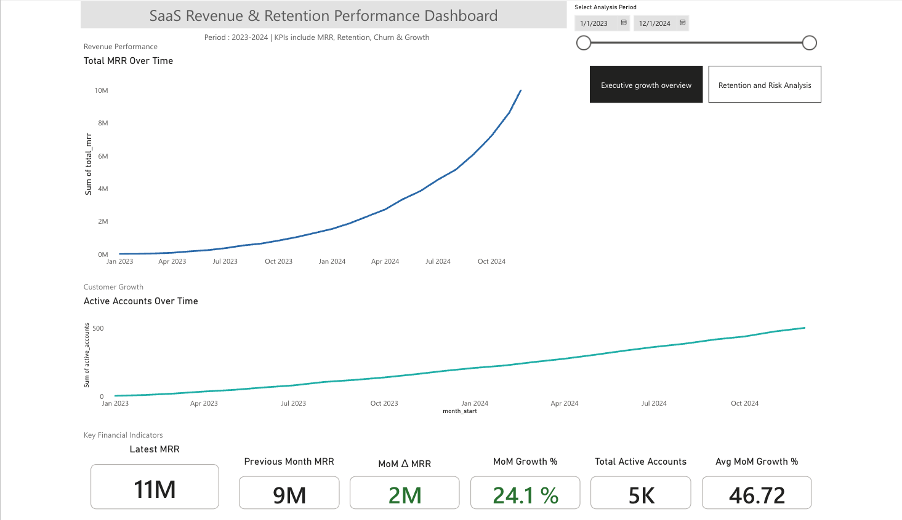

SaaS Revenue & Retention Executive Dashboard

A C-level executive SaaS KPI dashboard built in Power BI to analyze revenue growth, churn behavior, and net revenue retention trends.

This project simulates how SaaS leadership teams monitor company health, identify risk signals, and evaluate revenue sustainability.

# Live Interactive Dashboard
https://app.powerbi.com/reportEmbed?reportId=cacc3624-2909-4c2f-8654-31510048d20a&autoAuth=true&ctid=3664e6fa-47bd-45a6-9670-8c4f080f8ca6

# Executive Summary
This dashboard evaluates SaaS growth quality by analyzing:
- Monthly Recurring Revenue (MRR)
- Month-over-Month (MoM) Growth
- Logo Churn %
- Revenue Churn ($)
- Active Accounts
- Net Revenue Retention (NRR)
- Churn Risk Classification

# Key Findings
• Early churn volatility stabilized mid-2023  
• Recent upward churn drift indicates rising retention risk  
• Revenue lost to churn accelerating in latest months  
• Net Revenue Retention below 100% indicates contraction pressure  

This dashboard demonstrates how growth and retention metrics must be evaluated together to understand long-term SaaS sustainability.

# Dataset
Dataset: "SaaS Revenue & Retention Dataset" – Kaggle
The dataset simulates monthly SaaS company performance.
Primary fields:
- month_start
- total_mrr
- churned_mrr
- churned_accounts
- active_accounts
- monthly_logo_churn_pct

Data Source: Simulated SaaS KPI dataset (Excel)

# Dashboard Structure

# Page 1 — Executive Growth Overview

- Total MRR Over Time
- Active Accounts Trend
- Latest MRR
- Previous Month MRR
- MoM Revenue Change
- MoM Growth %
- Total Active Accounts
- Avg MoM Growth %

# Page 2 — Retention & Risk Analysis

- Customer Logo Churn Trend
- Rolling 3M Churn %
- Monthly Revenue Lost to Churn
- Growth vs Revenue Loss (MoM)
- Net Revenue Retention (NRR %)
- Total Churned Accounts
- Total Churned MRR
- Churn Risk Status Indicator

# KPI Definitions

# MRR (Monthly Recurring Revenue)
Total subscription revenue for the month.

# Logo Churn %
Percentage of customers lost during the month.

# Revenue Churn
Total recurring revenue lost from churned customers.

# Net Revenue Retention (NRR)
NRR = (Starting MRR - Churned MRR + Expansion MRR) / Starting MRR
NRR > 100% = Expansion  
NRR < 100% = Contraction  

# Rolling 3M Churn %
3-month moving average to smooth volatility.

# DAX Measures
Below are key measures used in this project.

## Latest MRR 
Latest MRR =
CALCULATE(
SUM(monthly_company_kpis[total_mrr]),
LASTDATE(monthly_company_kpis[month_start])
)

## Previous Month MRR
Previous Month MRR =
CALCULATE(
SUM(monthly_company_kpis[total_mrr]),
DATEADD(monthly_company_kpis[month_start], -1, MONTH)
)

## MoM MRR Change
MoM MRR Delta =
MoM MRR Delta =
[Latest MRR] - [Previous Month MRR]

## MoM Growth %
MoM Growth % =
DIVIDE(
[MoM MRR Delta],
[Previous Month MRR]
)

## Rolling 3 Month Churn %
Rolling 3M Churn % =
AVERAGEX(
DATESINPERIOD(
monthly_company_kpis[month_start],
MAX(monthly_company_kpis[month_start]),
-3,
MONTH
),
CALCULATE(AVERAGE(monthly_company_kpis[monthly_logo_churn_pct]))
)

## Net Revenue Retention %
NRR % =
VAR CurrentMRR = SUM(monthly_company_kpis[total_mrr])
VAR ChurnMRR = SUM(monthly_company_kpis[churned_mrr])
RETURN
DIVIDE(CurrentMRR - ChurnMRR, CurrentMRR) * 100

## Churn Risk Status
Churn Risk Status =
IF(
[Rolling 3M Churn %] > 10,
“⚠ Rising Risk”,
“Stable”
)

# Design Decisions
- Clean consultant-style layout
- Minimal color palette
- Conditional formatting for risk signaling
- Constant benchmark line for NRR = 100%
- KPI cards aligned for executive readability
- White space optimized for clarity

# Tools Used
- Power BI (Web)
- DAX
- Excel (Data preparation)
- GitHub (Version control & documentation)

# Business Value Demonstrated
This project demonstrates:
- SaaS metric literacy
- Executive-level KPI storytelling
- Growth vs retention trade-off analysis
- Risk signal detection
- Advanced DAX modeling
- Dashboard UX design principles

# Dashboard Preview

# Repository Structure
SaaS-Revenue-Retention-Dashboard/
│
├── Executive_page.png
├── SaaS_Dataset.xlsx
├── DAX_Measures.md
├── README.md
└── LICENSE
---

# Author
Harsh Patodi  
MS Business Analytics  
Fraud & Risk Analytics | SaaS KPI Modeling | Data Strategy  
